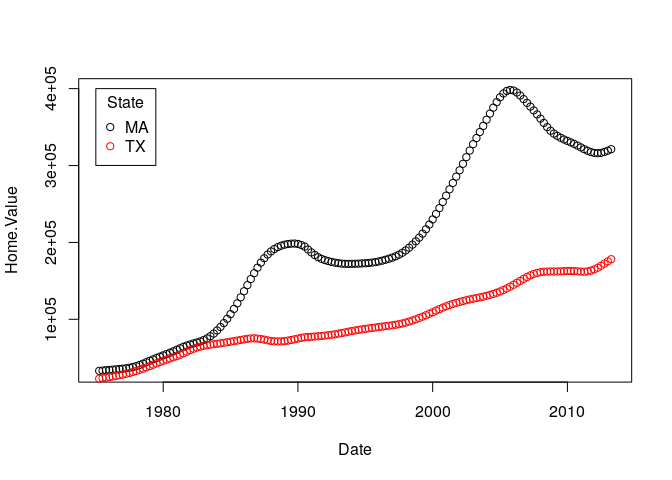
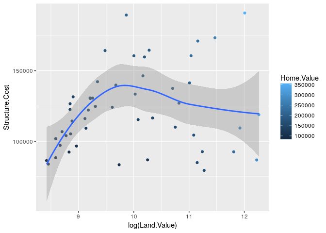
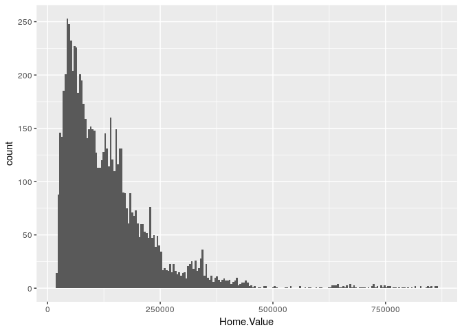
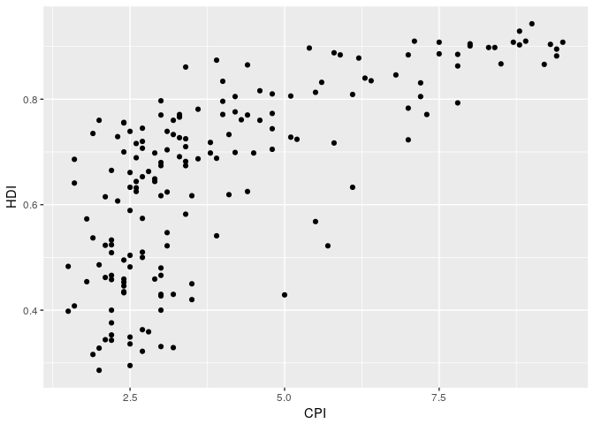
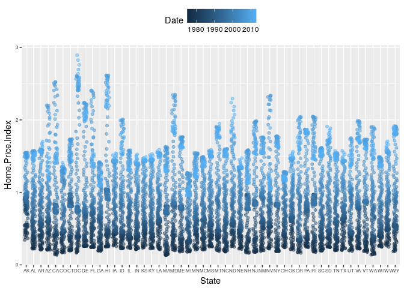
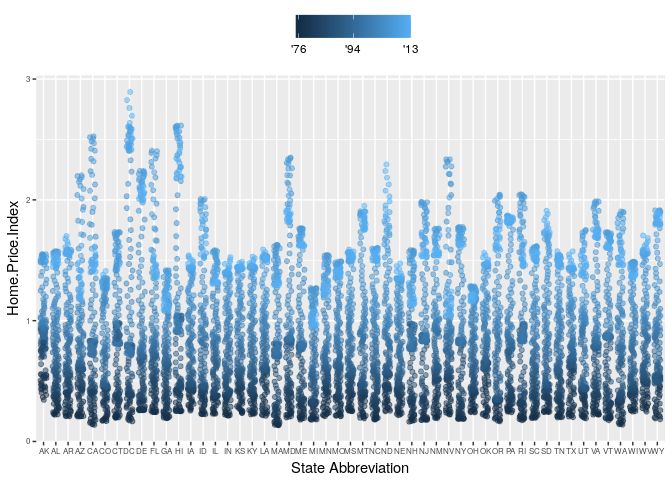
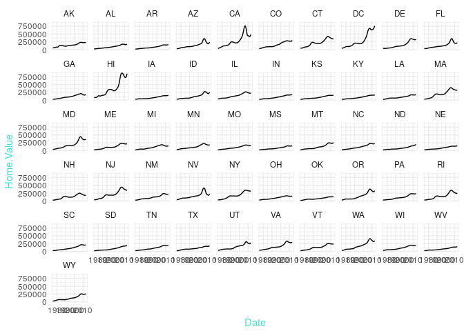
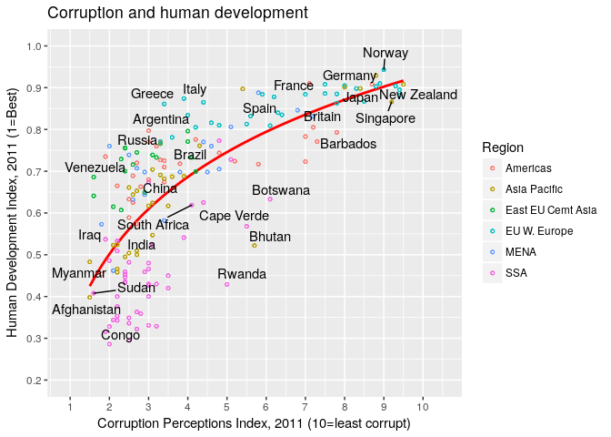

week 8 lab hw
================
Jeremy Wadowski
March 1, 2017

``` r
#http://tutorials.iq.harvard.edu/R/Rgraphics/Rgraphics.html#org93999d8
housing <- read.csv("/home/eeb177-student/Desktop/eeb-177/lab-work/exercise-8/Rgraphics/dataSets/landdata-states.csv")
head(housing[1:5])
```

    ##   State region    Date Home.Value Structure.Cost
    ## 1    AK   West 2010.25     224952         160599
    ## 2    AK   West 2010.50     225511         160252
    ## 3    AK   West 2009.75     225820         163791
    ## 4    AK   West 2010.00     224994         161787
    ## 5    AK   West 2008.00     234590         155400
    ## 6    AK   West 2008.25     233714         157458

``` r
#Base graphics histogram example
hist(housing$Home.Value)
```

 \#\# ggplot2 histogram example

``` r
library(ggplot2)
ggplot(housing, aes(x = Home.Value)) + geom_histogram()
```

    ## `stat_bin()` using `bins = 30`. Pick better value with `binwidth`.

 \#\# Base colored scatter plot example

``` r
plot(Home.Value ~ Date,
     data=subset(housing, State == "MA"))
points(Home.Value ~ Date, col="red",
       data=subset(housing, State == "TX"))
legend(1975, 400000,
       c("MA", "TX"), title="State",
       col=c("black", "red"),
       pch=c(1, 1))
```

 \#\# ggplot2 colored scatter plot example

``` r
ggplot(subset(housing, State %in% c("MA", "TX")),
       aes(x=Date,
           y=Home.Value,
           color=State))+
  geom_point()
```

 \# Geometric Objects and Aesthetic

``` r
hp2001Q1 <- subset(housing, Date == 2001.25) 
ggplot(hp2001Q1,
       aes(y = Structure.Cost, x = Land.Value)) +
  geom_point()
```


``` r
hp2001Q1$pred.SC <- predict(lm(Structure.Cost ~ log(Land.Value), data = hp2001Q1))

p1 <- ggplot(hp2001Q1, aes(x = log(Land.Value), y = Structure.Cost))

p1 + geom_point(aes(color = Home.Value)) +
  geom_line(aes(y = pred.SC))
```


``` r
p1 +
  geom_point(aes(color = Home.Value)) +
  geom_smooth()
```

    ## `geom_smooth()` using method = 'loess'



``` r
p1 + 
  geom_text(aes(label=State), size = 3)
```


``` r
#install.packages("ggrepel") 
library("ggrepel")
p1 + 
  geom_point() + 
  geom_text_repel(aes(label=State), size = 3)
```


``` r
p1 +
  geom_point(aes(size = 2),# incorrect! 2 is not a variable
             color="red") # this is fine -- all points red
```


``` r
p1 +
  geom_point(aes(color=Home.Value, shape = region))
```

    ## Warning: Removed 1 rows containing missing values (geom_point).

 \# Exercise 1

``` r
dat <- read.csv("/home/eeb177-student/Desktop/eeb-177/lab-work/exercise-8/Rgraphics/dataSets/EconomistData.csv")
head(dat)
```

    ##   X     Country HDI.Rank   HDI CPI            Region
    ## 1 1 Afghanistan      172 0.398 1.5      Asia Pacific
    ## 2 2     Albania       70 0.739 3.1 East EU Cemt Asia
    ## 3 3     Algeria       96 0.698 2.9              MENA
    ## 4 4      Angola      148 0.486 2.0               SSA
    ## 5 5   Argentina       45 0.797 3.0          Americas
    ## 6 6     Armenia       86 0.716 2.6 East EU Cemt Asia

``` r
ggplot(dat, aes(x = CPI, y = HDI, size = HDI.Rank)) + geom_point()
```


``` r
ggplot(dat, aes(x = CPI, y = HDI)) + geom_point()
```


``` r
ggplot(dat, aes(x = CPI, y = HDI), color="blue") + geom_point()
```


``` r
ggplot(dat, aes(x = CPI, y = HDI, size = HDI.Rank, color=Region)) + geom_point()
```

 \# Setting Statistical Transformation Arguments

``` r
args(geom_histogram)
```

    ## function (mapping = NULL, data = NULL, stat = "bin", position = "stack", 
    ##     ..., binwidth = NULL, bins = NULL, na.rm = FALSE, show.legend = NA, 
    ##     inherit.aes = TRUE) 
    ## NULL

``` r
args(stat_bin)
```

    ## function (mapping = NULL, data = NULL, geom = "bar", position = "stack", 
    ##     ..., binwidth = NULL, bins = NULL, center = NULL, boundary = NULL, 
    ##     breaks = NULL, closed = c("right", "left"), pad = FALSE, 
    ##     na.rm = FALSE, show.legend = NA, inherit.aes = TRUE) 
    ## NULL

``` r
p2 <- ggplot(housing, aes(x = Home.Value))
p2 + geom_histogram()
```

    ## `stat_bin()` using `bins = 30`. Pick better value with `binwidth`.


``` r
#with changed bin value
p2 + geom_histogram(stat = "bin", binwidth=4000)
```



``` r
#Changing the Statistical Transformation
housing.sum <- aggregate(housing["Home.Value"], housing["State"], FUN=mean)
rbind(head(housing.sum), tail(housing.sum))
```

    ##    State Home.Value
    ## 1     AK  147385.14
    ## 2     AL   92545.22
    ## 3     AR   82076.84
    ## 4     AZ  140755.59
    ## 5     CA  282808.08
    ## 6     CO  158175.99
    ## 46    VA  155391.44
    ## 47    VT  132394.60
    ## 48    WA  178522.58
    ## 49    WI  108359.45
    ## 50    WV   77161.71
    ## 51    WY  122897.25

``` r
#Doesn't work because we are asking ggplot to bin and summarize already binned and summarized data
#ggplot(housing.sum, aes(x=State, y=Home.Value)) + geom_bar()
#instead:
ggplot(housing.sum, aes(x=State, y=Home.Value)) + 
  geom_bar(stat="identity")
```

 \# Exercise 2

``` r
dat <- read.csv("/home/eeb177-student/Desktop/eeb-177/lab-work/exercise-8/Rgraphics/dataSets/EconomistData.csv")
head(dat)
```

    ##   X     Country HDI.Rank   HDI CPI            Region
    ## 1 1 Afghanistan      172 0.398 1.5      Asia Pacific
    ## 2 2     Albania       70 0.739 3.1 East EU Cemt Asia
    ## 3 3     Algeria       96 0.698 2.9              MENA
    ## 4 4      Angola      148 0.486 2.0               SSA
    ## 5 5   Argentina       45 0.797 3.0          Americas
    ## 6 6     Armenia       86 0.716 2.6 East EU Cemt Asia

``` r
ggplot(dat, aes(x = CPI, y = HDI))+ geom_point()
```



``` r
ggplot(dat, aes(x = CPI, y = HDI))+ geom_point() + geom_smooth()
```

    ## `geom_smooth()` using method = 'loess'


``` r
c(method="lm")
```

    ## method 
    ##   "lm"

``` r
ggplot(dat, aes(x = CPI, y = HDI))+ geom_point() + geom_line(stat="identity")
```


``` r
ggplot(dat, aes(x = CPI, y = HDI))+ geom_point() + geom_smooth(span = .2)
```

    ## `geom_smooth()` using method = 'loess'

 \#\# Scale Modification Examples

``` r
p3 <- ggplot(housing,
             aes(x = State,
                 y = Home.Price.Index)) + 
        theme(legend.position="top",
              axis.text=element_text(size = 6))
(p4 <- p3 + geom_point(aes(color = Date),
                       alpha = 0.5,
                       size = 1.5,
                       position = position_jitter(width = 0.25, height = 0)))
```



``` r
p4 + scale_x_discrete(name="State Abbreviation") +
  scale_color_continuous(name="",
                         breaks = c(1976, 1994, 2013),
                         labels = c("'76", "'94", "'13"))
```



``` r
p4 +
  scale_x_discrete(name="State Abbreviation") +
  scale_color_continuous(name="",
                         breaks = c(1976, 1994, 2013),
                         labels = c("'76", "'94", "'13"),
                         low = "blue", high = "red")
```


``` r
#p4 +
  #scale_color_continuous(name="",
                         #breaks = c(1976, 1994, 2013),
                         #labels = c("'76", "'94", "'13"),
                         #low = muted("blue"), high = muted("red"))  #does not work with current package, requires scale package

#midpoint and different color scales
p4 +
  scale_color_gradient2(name="",
                        breaks = c(1976, 1994, 2013),
                        labels = c("'76", "'94", "'13"),
                        low = ("blue"),
                        high = ("red"),
                        mid = "gray60",
                        midpoint = 1994)
```

 \#\# Exercise 3

``` r
dat <- read.csv("/home/eeb177-student/Desktop/eeb-177/lab-work/exercise-8/Rgraphics/dataSets/EconomistData.csv")

ggplot(dat, aes(x = CPI, y = HDI, color = "Region")) +
    geom_point()
```


``` r
  ggplot(dat, aes(x = CPI, y = HDI, color = "Region")) +
  geom_point() +
  scale_x_continuous(name = "Corruption Perception Index") +
  scale_y_continuous(name = "Human Development Index") +
  scale_color_discrete(name = "World Regions")
```


``` r
 ggplot(dat, aes(x = CPI, y = HDI, color = "Region")) +
  geom_point() +
  scale_x_continuous(name = "Corruption Perception Index") +
  scale_y_continuous(name = "Human Development Index") +
    scale_color_manual(name = "Region of the world",
                       values = c("#24576D",
                                  "#099DD7",
                                  "#28AADC",
                                  "#248E84",
                                  "#F2583F",
                                  "#96503F")) #no different colors?? 
```

 \#\# Faceting

``` r
p5 <- ggplot(housing, aes(x = Date, y = Home.Value))
p5 + geom_line(aes(color = State)) #produces obscure lines
```


``` r
(p5 <- p5 + geom_line() +
   facet_wrap(~State, ncol = 10))
```

 \#\# Themes

``` r
p5 + theme_linedraw()
```


``` r
p5 + theme_light()
```


``` r
p5 + theme_minimal() +
  theme(text = element_text(color = "turquoise"))
```



``` r
#creating new themes
theme_new <- theme_bw() +
  theme(plot.background = element_rect(size = 1, color = "blue", fill = "black"),
        text=element_text(size = 12, family = "Serif", color = "ivory"),
        axis.text.y = element_text(colour = "purple"),
        axis.text.x = element_text(colour = "red"),
        panel.background = element_rect(fill = "pink"),
        strip.background = element_rect(fill = ("orange")))

p5 + theme_new
```

 \#\# Best way to plot a data.frame of two variables as separate points with different colors?

``` r
#not this way:
library(tidyr)
housing.byyear <- aggregate(cbind(Home.Value, Land.Value) ~ Date, data = housing, mean)
ggplot(housing.byyear,
       aes(x=Date)) +
  geom_line(aes(y=Home.Value), color="red") +
  geom_line(aes(y=Land.Value), color="blue")
```


``` r
#but this way:
home.land.byyear <- gather(housing.byyear,
                           value = "value",
                           key = "type",
                           Home.Value, Land.Value)
ggplot(home.land.byyear,
       aes(x=Date,
           y=value,
           color=type)) +
  geom_line()
```

 \# Putting It All Together: Recreate Economist Graph

``` r
dat <- read.csv("/home/eeb177-student/Desktop/eeb-177/lab-work/exercise-8/Rgraphics/dataSets/EconomistData.csv")

first <- ggplot(dat, aes(x = CPI, y = HDI, color = Region))
first + geom_point()
```


``` r
(second <- first + geom_smooth(aes(group = 1), method = "lm", formula = y ~ log(x), se = FALSE, color = "red")) + geom_point()
```


``` r
(third <- second + geom_point(size = 1, shape = 1) + geom_point(size = 1, shape = 1) + geom_point(size = 1, shape = 1))
```


``` r
labeled_countries <- c("Congo", "Afghanistan", "Sudan", "Myanmar", "Iraq", "India", "Rwanda", "South Africa", "China", "Venezuela", "Russia", "Argentina", "Greece", "Brazil", "Italy", "Bhutan", "Cape Verde", "Botswana", "Spain", "France", "US", "Britain", "Barbados", "Japan", "Germany", "Norway", "Singapore", "New Zealand")

dat$Country <- as.character(dat$Country)
as.character(dat$Country) %in% labeled_countries
```

    ##   [1]  TRUE FALSE FALSE FALSE  TRUE FALSE FALSE FALSE FALSE FALSE FALSE
    ##  [12] FALSE  TRUE FALSE FALSE FALSE  TRUE FALSE FALSE  TRUE  TRUE  TRUE
    ##  [23] FALSE FALSE FALSE FALSE FALSE FALSE  TRUE FALSE FALSE FALSE  TRUE
    ##  [34] FALSE FALSE  TRUE FALSE FALSE FALSE FALSE FALSE FALSE FALSE FALSE
    ##  [45] FALSE FALSE FALSE FALSE FALSE FALSE FALSE FALSE FALSE FALSE FALSE
    ##  [56]  TRUE FALSE FALSE FALSE  TRUE FALSE  TRUE FALSE FALSE FALSE FALSE
    ##  [67] FALSE FALSE FALSE FALSE FALSE  TRUE FALSE FALSE  TRUE FALSE FALSE
    ##  [78]  TRUE FALSE  TRUE FALSE FALSE FALSE FALSE FALSE FALSE FALSE FALSE
    ##  [89] FALSE FALSE FALSE FALSE FALSE FALSE FALSE FALSE FALSE FALSE FALSE
    ## [100] FALSE FALSE FALSE FALSE FALSE FALSE FALSE FALSE FALSE FALSE  TRUE
    ## [111] FALSE FALSE FALSE  TRUE FALSE FALSE FALSE  TRUE FALSE FALSE FALSE
    ## [122] FALSE FALSE FALSE FALSE FALSE FALSE FALSE FALSE  TRUE  TRUE FALSE
    ## [133] FALSE FALSE FALSE FALSE FALSE FALSE FALSE  TRUE FALSE FALSE FALSE
    ## [144]  TRUE  TRUE FALSE  TRUE FALSE FALSE FALSE FALSE FALSE FALSE FALSE
    ## [155] FALSE FALSE FALSE FALSE FALSE FALSE FALSE FALSE FALSE FALSE FALSE
    ## [166] FALSE FALSE FALSE FALSE  TRUE FALSE FALSE FALSE

``` r
country_to_print <- character(nrow(dat))
printrows <- which(as.character(dat$Country) %in% labeled_countries) 
#country_to_print[printrows] <- #dat$Country[printrows]

library("ggrepel")
(fourth <- third + geom_text_repel(aes(label = Country), color = "black", data = subset(dat, Country%in%labeled_countries), force = 6))
```


``` r
library(grid)
(fifth <- fourth + ggtitle("Corruption and human development") + scale_x_continuous(name = "Corruption Perceptions Index, 2011 (10=least corrupt)", limits = c(.9, 10.5), breaks = 1:10) + scale_y_continuous(name = "Human Development Index, 2011 (1=Best)", limits = c(0.2, 1.0), breaks = seq(0.2, 1.0, by = 0.1)))
```



``` r
(sixth <- fifth + theme_minimal() + theme(text = element_text(color = "black"), legend.position = c("top"), legend.direction = "horizontal", legend.justification = 0.25, legend.text = element_text(size = 8, color = "black"), axis.text = element_text(face = "italic", size = 5), axis.ticks.y = element_blank(), axis.line = element_line(color = "black", size = 0.4),axis.line.y =element_blank(), panel.grid.major = element_line(color = "black", size = 0.4),panel.grid.major.x = element_blank()))
```


